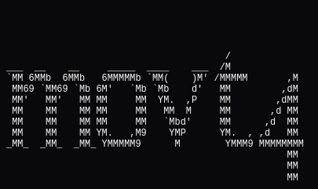
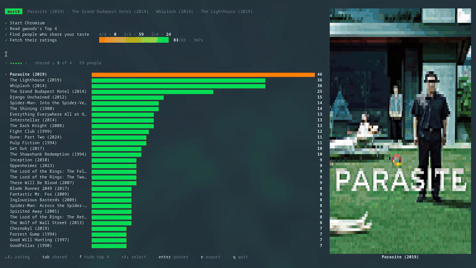

<h1 align="center"></h1>

Find Letterboxd members who share your Top 4 favorite films and what they liked. movt4 searches for people whose favorites overlap yours by 2, 3 or
all 4 films, reads their ratings, and charts the films they rated most.



## Requirements

- Go 1.26+
- Chromium or Google Chrome.

## Install

```sh
go build ./cmd/movt4
```

## Usage

```sh
movt4 <letterboxd-username>
movt4 --films "parasite, grand budapest, whiplash, lighthouse"
```

Films are separated by commas. Names don't need exact spelling or a year
("grand budpest" and "parasite 2019" both work), and Letterboxd film URLs
work too.

| Flag           | Default   | Description                                         |
| -------------- | --------- | --------------------------------------------------- |
| `--stars`      | `5,4.5,4` | Star ratings to fetch for each matched member       |
| `--min-shared` | `2`       | Fewest shared favorites that count as a match (2-4) |
| `--max-users`  | `100`     | Most members to scan, `0` for no limit              |
| `--delay`      | `1s`      | Pause between Letterboxd requests                   |

Matches are filled from the closest tier down: everyone sharing all 4 films,
then 3, then 2, until `--max-users` is reached.

Chromium keeps its profile in your cache directory (`~/.cache/movt4/chromium`
on Linux), so Letterboxd sees a returning visitor. If Cloudflare still pushes
back, movt4 slows down, retries, and skips members it can't reach. After three
blocked members in a row it finishes with the results it has. A longer
`--delay` makes blocks less likely.

### Keys

| Key   | Action                                    |
| ----- | ----------------------------------------- |
| ← / → | Switch star rating                        |
| tab   | Cycle the minimum number of shared films  |
| f     | Hide or show your Top 4 films             |
| ↑ / ↓ | Select a film and show its poster         |
| enter | Show the selected poster full size        |
| e     | Export results to JSON and CSV            |
| q     | Quit                                      |

## Exports

Pressing `e` writes two files to the current directory, at any point during
or after a scan. Exports include every film, even while your Top 4 is hidden:

- `movt4-<name>-<time>.json` has every matched member, how many favorites they
  share, and the films they gave each rating.
- `movt4-<name>-<time>.csv` has one row per film and rating, with counts split
  by how many favorites the members share
  (`rating,slug,title,shared_4,shared_3,shared_2,total`).

## Development

```sh
go test ./...                              # unit tests against saved pages
go test -tags live ./internal/letterboxd/  # checks the real Letterboxd site
```

The live tests are the quickest way to find out whether Letterboxd has changed
its markup or its Cloudflare rules.
